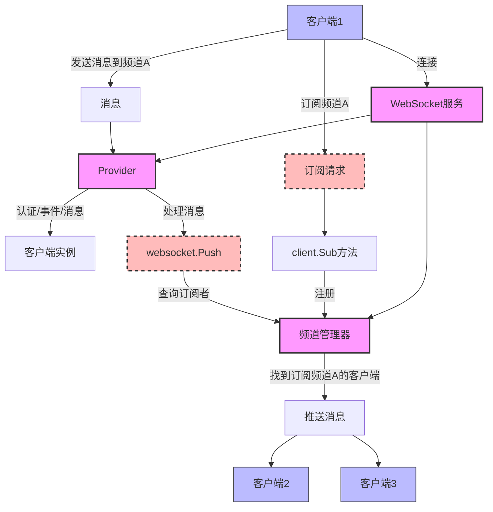

# go-ws

go-ws 是一个基于 Golang 的 WebSocket 通讯库，为开发实时通信应用提供简单易用的接口。该库将 Websocket 封装成认证、事件、频道、订阅方法，无需关心内部通讯即可利用频道订阅方式接收发送消息。

go-ws is a Golang-based WebSocket communication library that provides simple and user-friendly interfaces for developing real-time communication applications. This library encapsulates Websocket into authentication, events, channels, and subscription methods, allowing you to receive and send messages via channel subscriptions without worrying about internal communication.


## 分布式
## Distributed Architecture

go-ws 支持分布式部署，可通过配置不同的驱动实现单机或分布式环境下的消息传递。目前支持内存驱动（单机）和 Redis 驱动（分布式），可根据项目需求选择合适的驱动。

go-ws supports distributed deployment and can achieve message delivery in both single-server and distributed environments through different drivers. Currently, it supports memory driver (single-server) and Redis driver (distributed), allowing you to choose the appropriate driver based on your project requirements.

## 特性
## Features

- WebSocket 连接管理 (WebSocket connection management)
- 客户端认证机制 (Client authentication mechanism)
- 频道订阅/取消订阅 (Channel subscription/unsubscription)
- 实时消息推送 (Real-time message pushing)
- 客户端在线状态管理 (Client online status management)
- 可扩展的应用提供者系统 (Extensible application provider system)
- 多驱动支持（内存、Redis）(Multiple driver support: Memory, Redis)
- 分布式部署支持 (Distributed deployment support)

## 架构流程图
## Architecture Flow Chart



## 安装
## Installation

```bash
go get github.com/duxweb/go-ws
```

## 快速开始
## Quick Start

### 驱动选择
### Driver Selection

go-ws 支持多种驱动，可以根据应用场景选择合适的驱动：

go-ws supports multiple drivers, and you can choose the appropriate driver based on your application scenario:

#### 内存驱动 (单机模式)
#### Memory Driver (Single-server Mode)

适用于单机部署，所有消息和订阅都在内存中处理，无需额外依赖。

Suitable for single-server deployment, all messages and subscriptions are processed in memory without additional dependencies.

```go
import (
    websocket "github.com/duxweb/go-ws"
    "github.com/duxweb/go-ws/drivers"
)

// 初始化内存驱动
// Initialize memory driver
service := websocket.New(drivers.NewMemoryDriver())
service.Run()
```

#### Redis 驱动 (分布式模式)
#### Redis Driver (Distributed Mode)

适用于分布式部署，通过 Redis 存储订阅关系并转发消息，支持横向扩展。

Suitable for distributed deployment, subscription relationships are stored in Redis and messages are forwarded through Redis, supporting horizontal scaling.

```go
import (
    "github.com/redis/go-redis/v9"
    websocket "github.com/duxweb/go-ws"
    "github.com/duxweb/go-ws/drivers"
)

// 初始化 Redis 驱动
// Initialize Redis driver
redisDriver, err := drivers.NewRedisDriver(&drivers.RedisOptions{
    Addr:     "localhost:6379",
    Password: "",
    DB:       0,
    Prefix:   "ws",  // 可选：Redis 键前缀 (Optional: Redis key prefix)
})
if err != nil {
    panic(err)
}

// 使用现有的 Redis 客户端
// Or use an existing Redis client
// redisDriver, err := drivers.NewRedisDriver(&drivers.RedisOptions{
//     Client: redisClient,
// })

service := websocket.New(redisDriver)
service.Run()
```

### 初始化 WebSocket 服务
### Initialize WebSocket Service

以下示例展示了如何使用 Redis 驱动初始化 WebSocket 服务：

The following example shows how to initialize the WebSocket service using the Redis driver:

```go
package main

import (
	"fmt"
	"log"
	"net/http"
	"time"

	websocket "github.com/duxweb/go-ws"
	"github.com/duxweb/go-ws/drivers"
)

func main() {
	// 初始化 Redis 驱动 (分布式模式)
	// Initialize Redis driver (distributed mode)
	redisDriver, err := drivers.NewRedisDriver(&drivers.RedisOptions{
		Addr:     "localhost:6379",
		Password: "",
		DB:       0,
		Prefix:   "ws",
	})
	if err != nil {
		panic(err)
	}


	// 创建一个Provider
	// Create a Provider
	provider := &websocket.Provider{
		Auth: func(token string) (map[string]any, error) {
			// 简单的认证逻辑，直接使用token作为用户名
			// Simple authentication logic, use token directly as username
			if token == "" {
				return nil, fmt.Errorf("请输入用户名")
			}

			// 打印用户连接信息
			// Print user connection information
			fmt.Printf("用户 [%s] 正在连接\n", token)

			// 返回客户端ID和其他数据
			// Return client ID and other data
			return map[string]any{
				"client_id": token, // 使用token作为客户端ID (use token as client ID)
				"user_name": token, // 使用token作为用户名 (use token as username)
			}, nil
		},
		Event: func(name string, client *websocket.Client) error {
			// 处理事件：上线、下线、ping
			// Handle events: online, offline, ping
			fmt.Printf("客户端 %s 触发事件: %s\n", client.ClientID, name)

			// 如果是上线事件，发送欢迎消息
			// If online event, send welcome message
			if name == "online" {
				// 使用客户端ID作为用户名
				// Use client ID as username
				userName := client.ClientID

				client.Send(&websocket.Message{
					Type:    "system",
					Message: fmt.Sprintf("欢迎 %s，连接成功!", userName),
					ID:      fmt.Sprintf("%d", time.Now().UnixMilli()), // 添加时间戳ID (add timestamp ID)
				})

				// 打印用户上线信息
				// Print user online information
				fmt.Printf("用户 [%s] 已成功连接\n", userName)
			}

			// 如果是下线事件，打印日志
			// If offline event, print log
			if name == "offline" {
				fmt.Printf("用户 [%s] 已断开连接\n", client.ClientID)
			}

			return nil
		},
		Message: func(message *websocket.Message, client *websocket.Client) error {
			// 处理接收到的消息
			// Process received messages
			fmt.Printf("收到客户端 %s 的消息: %s\n", client.ClientID, message.Message)

			if message.Type == "message" {
				// 创建消息载荷
				// Create message payload
				payload := &websocket.Message{
					Type:    "message",
					Message: message.Message,
					ID:      message.ID,
					Meta:    message.Meta,
				}

				// 将消息广播到频道
				// Broadcast message to channel
				client.Push([]string{message.Channel}, payload)
			}

			if message.Type == "subscribe" {
				client.Sub(message.Channel)
			}

			if message.Type == "unsubscribe" {
				client.Unsub(message.Channel)
			}

			return nil
		},
	}

	// 初始化WebSocket服务
	// Initialize WebSocket service
	service := websocket.New(redisDriver, provider)


  //运行 WS 服务
	service.Run()


	// 设置HTTP服务器
	// Set up HTTP server
	http.HandleFunc("/", func(w http.ResponseWriter, r *http.Request) {
		// 内置测试界面HTML代码...
		// Built-in test interface HTML code...
	})

	http.HandleFunc("/ws", func(w http.ResponseWriter, r *http.Request) {
		// 从URL参数中获取token（用户名）
		// Get token (username) from URL parameters
		token := r.URL.Query().Get("token")

		if token != "" {
			// 将token直接添加到请求头部
			// Add token directly to request header
			r.Header.Set("Token", token)
		}

		// 处理WebSocket请求
		// Handle WebSocket request
		service.Websocket.HandleRequest(w, r)
	})

	// 启动HTTP服务器
	// Start HTTP server
	fmt.Println("WebSocket服务器运行在 http://localhost:8080")
	log.Fatal(http.ListenAndServe(":8080", nil))
}
```

### 前端连接示例
### Frontend Connection Example

```javascript
// 创建WebSocket连接
// Create WebSocket connection
const username = "测试用户";
const ws = new WebSocket(`ws://localhost:8080/ws?token=${encodeURIComponent(username)}`);

// 连接建立后
// After connection established
ws.onopen = function() {
    console.log('连接已建立，等待服务器验证...');
};

// 接收消息
// Receive messages
ws.onmessage = function(e) {
    const data = JSON.parse(e.data);
    console.log('收到消息:', data);
};

// 订阅频道
// Subscribe to channel
function subscribe(channel) {
    ws.send(JSON.stringify({
        type: 'subscribe',
        channel: channel,
        id: Date.now().toString(),
    }));
}

// 取消订阅频道
// Unsubscribe from channel
function unsubscribe(channel) {
    ws.send(JSON.stringify({
        type: 'unsubscribe',
        channel: channel,
        id: Date.now().toString(),
    }));
}

// 发送消息
// Send message
function sendMessage(channel, message) {
    ws.send(JSON.stringify({
        id: Date.now().toString(),
        type: 'message',
        channel: channel,
        message: message,
        meta: {
            username: username
        }
    }));
}
```

### 消息格式
### Message Format

```json
{
  "id": "时间戳",
  "type": "message",
  "channel": "频道名称",
  "message": "消息内容",
  "data": {
    "params": "消息数据"
  },
  "meta": {
    "params": "元数据"
  }
}
```


## 核心概念
## Core Concepts

### Provider

Provider 是应用逻辑的提供者，包含三个主要处理函数：

Provider is the application logic provider, containing three main handler functions:

- **Auth**: 处理客户端认证
  - 函数签名: `func(token string) (map[string]any, error)`
  - 参数: `token` - 客户端提供的认证令牌
  - 返回: 包含客户端信息的map（必须包含`client_id`键）和可能的错误
  - 用途: 验证客户端身份，并提供客户端标识和元数据

- **Auth**: Handle client authentication
  - Signature: `func(token string) (map[string]any, error)`
  - Parameters: `token` - Authentication token provided by client
  - Returns: Map containing client information (must include `client_id` key) and possible error
  - Purpose: Validate client identity and provide client identification and metadata

- **Event**: 处理客户端事件（online、offline、ping）
  - 函数签名: `func(name string, client *Client) error`
  - 参数: `name` - 事件名称, `client` - 客户端实例
  - 支持的事件:
    - `online`: 客户端连接成功并认证通过
    - `offline`: 客户端断开连接
    - `ping`: 客户端发送心跳包
  - 用途: 响应客户端状态变化，执行相应的业务逻辑

- **Event**: Handle client events (online, offline, ping)
  - Signature: `func(name string, client *Client) error`
  - Parameters: `name` - Event name, `client` - Client instance
  - Supported events:
    - `online`: Client connected successfully and authenticated
    - `offline`: Client disconnected
    - `ping`: Client sent heartbeat
  - Purpose: Respond to client status changes and execute corresponding business logic

- **Message**: 处理客户端发送的消息
  - 函数签名: `func(message *Message, client *Client) error`
  - 参数: `message` - 消息数据, `client` - 客户端实例
  - 用途: 解析和处理客户端发送的消息，执行相应的业务逻辑，如消息转发、数据处理等
  - 常见操作: 根据消息类型(`message.Type`)执行不同操作，如订阅频道、发送消息等

- **Message**: Handle messages sent by client
  - Signature: `func(message *Message, client *Client) error`
  - Parameters: `message` - Message data, `client` - Client instance
  - Purpose: Parse and process messages sent by client, execute corresponding business logic like message forwarding, data processing, etc.
  - Common operations: Perform different actions based on message type (`message.Type`), such as subscribing to channels, sending messages, etc.

### Client

Client 代表一个已连接的客户端，提供以下属性和方法：

Client represents a connected client and provides the following attributes and methods:

- **ClientID**: 客户端唯一标识 (Client unique identifier)
- **App**: 客户端所属应用 (Application the client belongs to)
- **Token**: 客户端认证Token (Client authentication token)
- **Data**: 客户端附加数据 (Client additional data)
- **Sub(channels...)**: 订阅频道 (Subscribe to channels)
- **Unsub(channels...)**: 取消订阅频道 (Unsubscribe from channels)
- **Push(channels, data)**: 向频道推送消息 (Push message to channels)

### 频道订阅与推送
### Channel Subscription and Push

```go
// 订阅频道
// Subscribe to channels
client.Sub("channel1", "channel2")

// 向频道推送消息
// Push message to channels
websocket.Push([]string{"channel1"}, map[string]any{
    "type": "notification",
    "message": "频道消息",
})
```

### 简化流程
### Simplified Process

1. **注册Provider**: 配置认证、事件和消息处理逻辑
   **Register Provider**: Configure authentication, event, and message handling logic

2. **客户端连接**: 通过Provider认证后创建Client实例
   **Client Connection**: Create Client instance after authentication through Provider

3. **订阅频道**: 客户端调用Sub方法订阅感兴趣的频道
   **Subscribe to Channels**: Client calls Sub method to subscribe to channels of interest

4. **消息处理**: Provider处理客户端发送的消息
   **Message Processing**: Provider processes messages sent by client

5. **消息推送**: 通过Push方法向频道推送消息，自动分发给所有订阅者
   **Message Push**: Push messages to channels through Push method, automatically distributing to all subscribers

## 完整示例
## Complete Example

完整的示例可以在 `examples` 目录中找到。

Complete examples can be found in the `examples` directory.

## 许可证
## License

MIT 许可证 (MIT License)

## 驱动介绍
## Driver Introduction

### 内存驱动 (Memory Driver)

内存驱动将所有数据存储在内存中，适用于单机部署场景。优点是速度快、无外部依赖，缺点是不支持分布式部署，服务重启后数据丢失。

The memory driver stores all data in memory and is suitable for single-server deployment scenarios. The advantage is that it's fast and has no external dependencies, but the disadvantage is that it doesn't support distributed deployment, and data is lost after service restart.

```go
import (
    websocket "github.com/duxweb/go-ws"
    "github.com/duxweb/go-ws/drivers"
)

// 初始化内存驱动
// Initialize memory driver
driver := drivers.NewMemoryDriver()
service := websocket.New(driver)
```

### Redis 驱动 (Redis Driver)

Redis 驱动使用 Redis 存储订阅关系并转发消息，支持分布式部署。多个服务器实例可以共享相同的 Redis，实现消息的集中处理和分发。

The Redis driver uses Redis to store subscription relationships and forward messages, supporting distributed deployment. Multiple server instances can share the same Redis to achieve centralized message processing and distribution.

#### 配置选项
#### Configuration Options

| 选项 | 说明 | 默认值 |
| --- | --- | --- |
| Client | 已有的 Redis 客户端 | nil |
| Addr | Redis 服务器地址 | "localhost:6379" |
| Password | Redis 密码 | "" |
| DB | Redis 数据库序号 | 0 |
| Prefix | Redis 键前缀 | "ws" |
| PoolSize | 连接池大小 | 10 |
| MinIdleConns | 最小空闲连接数 | 5 |

| Option | Description | Default |
| --- | --- | --- |
| Client | Existing Redis client | nil |
| Addr | Redis server address | "localhost:6379" |
| Password | Redis password | "" |
| DB | Redis database number | 0 |
| Prefix | Redis key prefix | "ws" |
| PoolSize | Connection pool size | 10 |
| MinIdleConns | Minimum idle connections | 5 |

```go
import (
    "github.com/redis/go-redis/v9"
    websocket "github.com/duxweb/go-ws"
    "github.com/duxweb/go-ws/drivers"
)

// 方式1：使用配置选项
// Method 1: Using configuration options
driver, err := drivers.NewRedisDriver(&drivers.RedisOptions{
    Addr:         "localhost:6379",
    Password:     "your-password",
    DB:           0,
    Prefix:       "ws",
    PoolSize:     10,
    MinIdleConns: 5,
})

// 方式2：使用现有的 Redis 客户端
// Method 2: Using an existing Redis client
redisClient := redis.NewClient(&redis.Options{
    Addr:     "localhost:6379",
    Password: "your-password",
    DB:       0,
})
driver, err := drivers.NewRedisDriver(&drivers.RedisOptions{
    Client: redisClient,
    Prefix: "ws",
})

service := websocket.New(driver)
```